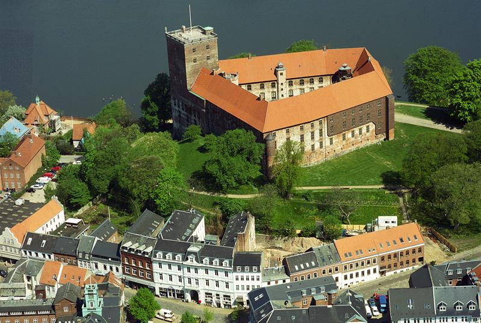
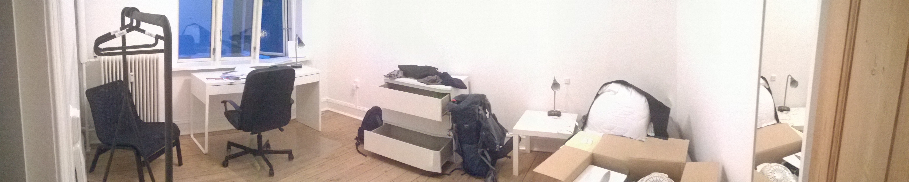
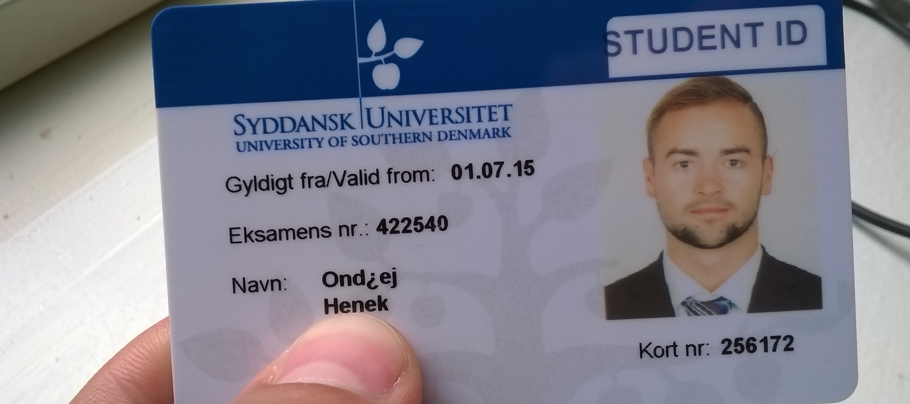

Dánsko, země nejšťastnějších lidí, země drahá, země placatá jako palačinka, země Malé mořské víly a samozřejmě země ochlastů. A také země, kde existuje neskutečně štědrá podpora pro studenty. A to je jeden z důvodů, proč jsem se tu rozhodl studovat IT Product Design na University of Southern Denmark.

<iframe src="https://www.google.com/maps/embed?pb=!1m18!1m12!1m3!1d8515.80384630844!2d9.471380643153125!3d55.484920568086665!2m3!1f0!2f0!3f0!3m2!1i1024!2i768!4f13.1!3m3!1m2!1s0x464c9f7c189ced6b%3A0x4f4caf24c103e092!2sHaderslevvej+22%2C+6000+Kolding!5e1!3m2!1sen!2sdk!4v1439999726220" width="100%" height="300px" frameborder="0" style="border:0" allowfullscreen></iframe>

## Vítejte v Dánsku!

Ve 4 ráno budíček a šup z brněnské postele na vlak, v půl osmé hledání letištního autobusu na pražském nádraží, v deset hodin vzlet a o hodinu později přistání. Krom pár slz, nevalného pocitu v žaludku ze včerejší rozlučky a mizerného spánku na sedadle docela pohodový výlet. Na letišti v Kodani se kupodivu ihned míchají přílety a odlety a všichni musejí šlapat asi kilometr pro svoje zavazadla. Pff!

Naštěstí na mě už čeká kamarádka Pauline, která do mě nacpe něco k jídlu a jdeme vyřizovat jízdenku. Z Kodaně do Koldingu se jede přes Odense, kde Pauline bydlí, takže s radostí přijímám pozvání domů na večeři a tuším, že to bude poslední valné jídlo na pár následujících nocí. Během 10 minut mám vyřízenou vlakovou kartičku pro studenty (500 Kč), která mi za okamžik ušetří polovinu z cestovného, které činí 1280Kč, po slevě 640Kč. Uf!

Dánský rychlík znamená pohodlná sedadla, wifi zdarma a nesmyslně navržené dveře, před kterýma muselo 20 procházejících vždycky mávat zběsile rukama, z toho tři to nakonec úplně vzdali a radši zůstali ve svém vagonu. Neříkám, že to není sranda pozorovat, ale pomalu se mi chtělo na záchod. Samozřejmě za těmi dveřmi...

Po troše cestování se ocitám v odpoledním Odense u Pauline doma, kde mě její obří vikingský přítel v mírném předklonu jednou rukou objímá. Poté se vrhá na vaření a slaninou ani majonézou nešetří. Takovýho chlapa prostě domů chceš! Mezitím dostávám instrukce kde nakupovat levně (Netto, Liva, Lidl), kde nakupovat [levné a použité](http://www.dba.dk) [věci a nábytek](http://www.guloggratis.dk), jak si [najít MHD](http://www.rejseplanen.dk), nebo zkusit štěstí na [spolujízdě](http://www.gomore.dk). Poslední můj dotaz je na [srovnávač cen](http://www.pricerunner.dk) a hned nato se podává grilovaná vepřová panenka s pestem obalená ve slanině s pečenými brambory a smetanovou omáčkou. Ach...

Nakonec dostávám snídaňový balíček s trochou chleba a šunky a jsem vyprovozen na nádraží. Je sedm hodin a já už s 20kg krosnou sotva pletu nohama. Vlak mě unáší krajinou, kterou jsem lehce zaspal, vidím spoustu větrných elektráren tyčících se z moře a pomalu přijíždím opět na pobřeží, tedy do cílové destinace.

## Kolding a ubytování

Kolding má asi 60 000 obyvatel, ale svojí rozlohou a hustotou obyvatel spíš připomíná tři menší města vedle sebe. Uprostřed se tyčí krásná cihlová pevnost z 13. století a okolo jsou stejně červené malé domečky tvořící historické centrum města. Krom parku, obrovského hřiště pro děti a přístavu tu už vlastně nic není. Z nádraží mě vyzvedává kamarád přidělený univerzitou a předává mi klíče od bytu, SIM kartu a spoustu papírů. Po cestě k mému novému domovu mi vysvětluje, jak to chodí, kde mám školu a trochu vtipkujem. Když otevírám dveře do svého pokoje, pomalu se se mnou loučí, ať se vyspím, že zítra zajdeme na pivo. To zní jako plán. Umírám do postele a je mi fajn.

Bydlím asi 10 minut z centra na jih, stejně tak to mám 10 minut do školy. Překvapením je otevírací dobra školy, do které můžu vejít na svoji studentskou kartu kdykoliv se mi zachce. Prý se odsud na Silvestra dobře sledují ohňostroje a popíjí pivo z nejvyššího balkonu. Škola taky zařizuje Welcome Package, ve kterém je prostěradlo, ručníky, utěrky a základní kuchyňské vybavení. To mi rozhodně ušetřilo pár korun a starostí.

Za svůj pokoj v pěkném 4+1 bytečku si sice řádně platím (3 000 DKK = 10 850 CZK), ale jsem skoro v centru, máme obýváček, fungující kuchyň, slušný nábytek a (bohužel trochu za rohem) terásku na grilování. Když jsem přijel, tak jsem trochu počítal, že tu bude pár základních věcí, ale držák na toaletní papír zející prázdnotou mě po ránu rychle vyvedl z omylu. Dalším lehkým šokem jsou pouze 2 zásuvky v pokoji, z toho jednu už okupuje krabice s internetem. Spolubydlící polák a němka mi přijedou až za týden, takže si to nakupování štětky nazáchod a podobných musím oběhat sám. 

## Nakupování

Očekával jsem, že tu bude neskutečně draze a s mým českým kapesným budu snídat bídu a večeřet nouzi, ale kupodivu to není tak zlý. Dánové to mají s číslama skoro stejně jako my, takže se vcelku jednoduše pozná "drahé" a "levné". Průměrný plat kolem 25 000, nájem v centru 3 000 a pivo v hospodě za dvacku. Jen se to musí prohnat kurzem, takže znásobit 3,6, a už jsme trochu jinde. Jenže třeba chleba za 10 krón, nebo iPhone za 6 tisíc dělá tuhle zemi ideálním místem k dlouhodobému pobytu. Když tu člověk sežene práci. A to chci!

Z elektroniky jsem si už stihl objednat externí disk, který stojí úplně stejně jako u nás. Drobná komplikace ale nastala s dopravou, protože nejlevnější varianta je vyzvednutí z úschovného boxu pošty, kam se naťuká číselný kód a přiloží občanka. S naivní myšlenkou, že mi to vezme i českou, jsem se vydal směrem k úschovně.

Nejdřív jsem zkusil mačkat tu svoji kartičku na skener, ale bez šance. Potom jsem přes automat zavolal na zákaznickou linku a pověděl jí svoji stiuaci. Prý jestli mám v dánsku nějaký kamarády, že stačí jejich karta. No samozřejmě! Jsem snad nějaký asociál? S nápadem využít náhodného kolemjdoucího se ptám, jestli je nakonec jedno, kdo naskenuje sovji kartu. Ano.

Zastavil jsem prvního chlapíka na ulici, popsal mu situaci a on mi s úsměvem odpoví, že není Dán. Na druhý pokus jsem zastavil slečnu, která se už tvářila přívětivěji. Jenže poté, co se chvíli přehrabovala v kabelce, něco vzkřikla, omluvila se, že nemá peněženku, a šla zase zpátky. Kliku jsem měl až napotřetí, stačilo vložit kartu a tadá, sejf otevřen, nákup je doma! :)

## Různé další postřehy...

- Plechovky od piva se tu vracejí, takže nemačkat! Za tři vrácený plechy se dá pořídit nový pivo! ;)
- Všichni umějí anglicky. Všichni.
- Lidi tu narozdíl od Řecka fungují! Když domácí řekne, že zítra zařídí sušák na prádlo, tak to udělá. Wow!
- Všude se platí kartou. I to jedno pivo za dvacku v zaplivané hospodě. Ale bezkontaktní platby jsou tu zatím jen výjimečně. :(
- Neuměj tu naše "ř"...

Příští sdělení už bude trochu rozkoukanější a třeba i něco procestuju. ;) Zatím!